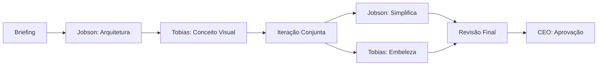

# 🎨 DUPLA CRIATIVA: JOBSON + TOBIAS

## A Dinâmica Perfeita de Design

### Por que essa dupla é GENIAL?

Imagine **Steve Jobs + Jonathan Ive + Tobias van Schneider** trabalhando juntos. É isso que temos aqui!

## 🤝 Como Funciona a Colaboração

### Jobson (Simplicidade Radical)
- **Inspiração**: Jonathan Ive, Dieter Rams
- **Foco**: Função, simplicidade, usabilidade
- **Mantra**: "Se não é simples, está errado"
- **Força**: Eliminar o desnecessário

### Tobias (Narrativa Visual)
- **Inspiração**: Tobias van Schneider
- **Foco**: Emoção, marca, experiência
- **Mantra**: "Design é narrativa"
- **Força**: Criar o inesquecível

## 🎯 Processo de Trabalho



## 💡 Exemplos Práticos

### Cenário 1: Nova Landing Page
```
@jobson-myfablab "Criar estrutura de landing page que converte"
@tobias-myfablab "Adicionar narrativa visual e branding memorável"
```

### Cenário 2: Redesign do Chat
```
@jobson-myfablab @tobias-myfablab "Melhorar interface do chat mantendo simplicidade mas adicionando personalidade"
```

### Cenário 3: Conflito Criativo
```
Jobson: "Muito complexo, precisa simplificar!"
Tobias: "Mas perde a alma sem esses detalhes!"
@ceo-myfablab "Resolver conflito entre simplicidade e beleza"
```

## 🔥 Resultados Esperados

### Sem Tobias (Só Jobson)
- ✅ Ultra funcional
- ✅ Simples e claro
- ❌ Pode ser "frio"
- ❌ Falta personalidade

### Sem Jobson (Só Tobias)
- ✅ Visualmente impressionante
- ✅ Emocionalmente envolvente
- ❌ Pode ser complexo
- ❌ Função sacrificada pela forma

### Jobson + Tobias
- ✅ Funcional E bonito
- ✅ Simples E memorável
- ✅ Usável E emocionante
- ✅ Produto que Jobs aprovaria!

## 🎨 Projetos que Precisam da Dupla

1. **Landing Page Principal**
   - Jobson: Conversão e clareza
   - Tobias: Wow factor e branding

2. **Onboarding Experience**
   - Jobson: Fluxo intuitivo
   - Tobias: Primeira impressão inesquecível

3. **Chat Interface**
   - Jobson: Usabilidade perfeita
   - Tobias: Personalidade e delícia

4. **Error States**
   - Jobson: Clareza da mensagem
   - Tobias: Transformar frustração em sorriso

5. **Empty States**
   - Jobson: Call-to-action claro
   - Tobias: Inspiração visual

## 📊 Métricas de Sucesso da Dupla

### Métricas do Jobson
- Task completion rate > 95%
- Error rate < 1%
- Time to complete < 30s
- Clicks to goal < 3

### Métricas do Tobias
- "Wow" comments > 50%
- Share rate > 30%
- Return rate > 60%
- Brand recall > 80%

### Métricas Combinadas
- NPS > 70
- User delight score > 9/10
- Conversion rate > 5%
- Viral coefficient > 1.2

## 🚀 Como Ativar a Dupla

### Para projeto completo:
```
@jobson-myfablab @tobias-myfablab "Redesign completo da experiência"
```

### Para revisão:
```
@jobson-myfablab "Revisar usabilidade"
@tobias-myfablab "Adicionar polish visual"
```

### Para conflito:
```
@ceo-myfablab "Jobson quer mais simples, Tobias quer mais bonito. Decidir."
```

## 💭 Filosofia da Dupla

> "Simplicidade é a sofisticação suprema" - Leonardo da Vinci (Jobson concorda)

> "Good design is invisible. Great design is unforgettable" - Tobias van Schneider (Tobias vive isso)

> "Design is not just what it looks like and feels like. Design is how it works" - Steve Jobs (Ambos concordam)

## 🎯 Regra de Ouro

Se Jobson diz "está complexo demais" OU Tobias diz "está sem alma", voltamos para a prancheta.

O ponto perfeito é quando AMBOS dizem: **"ISSO! É exatamente isso!"**

---

*Com Jobson + Tobias, o MyFabLab não será apenas funcional ou bonito. Será AMBOS, criando uma experiência que os usuários não conseguem esquecer nem deixar de usar.*