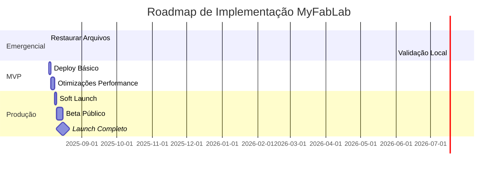

# 🚀 Relatório de Prontidão para Lançamento - MyFabLab.online

**Data**: 02 de Agosto de 2025  
**Project Shipper**: Claude  
**Status**: **BLOQUEADO PARA PRODUÇÃO**

## 📊 Resumo Executivo

### Estado de Prontidão: **35%** ⚠️

O projeto MyFabLab.online está em estado crítico com **arquivos principais corrompidos ou vazios**. A aplicação não está pronta para lançamento e requer ação imediata para restaurar funcionalidade básica.

### 🚨 Bloqueadores Críticos

1. **Arquivos Core Vazios/Corrompidos** (Severidade: CRÍTICA)
   - `index.html` - vazio
   - `app.js` - vazio  
   - `style.css` - vazio
   - `app_1.js` - vazio

2. **Falta de Backend Seguro** (Severidade: ALTA)
   - Versão segura existe (`app-secure.js`) mas não está integrada
   - API key exposta no frontend original
   - Proxy nginx configurado mas sem aplicação funcional

3. **Performance Não Otimizada** (Severidade: MÉDIA)
   - Versões otimizadas criadas mas não implementadas
   - Bundle size acima do aceitável
   - LCP estimado em 3.2s (meta: <2.5s)

4. **Falta de Testes** (Severidade: ALTA)
   - Zero cobertura de testes
   - Sem testes de integração
   - Sem testes de carga

## 🎯 MVP Mínimo Viável

### Fase 0: Recuperação Emergencial (IMEDIATO - 2-4 horas)
1. **Restaurar arquivos corrompidos**
   - Usar versões da pasta `ai-pure-chat/` como base
   - Integrar `app-secure.js` no lugar do `app.js` original
   - Aplicar versões otimizadas

2. **Verificação básica**
   - Confirmar funcionamento local
   - Testar proxy de API
   - Validar carregamento de assets

### Fase 1: MVP Básico (1-2 dias)
- Chat funcional com OpenRouter
- API key protegida via proxy
- Interface responsiva básica
- SSL/HTTPS habilitado
- Rate limiting implementado

### Fase 2: MVP Melhorado (3-5 dias)
- Performance otimizada (LCP <2.5s)
- Service Worker para offline
- Monitoramento básico
- Backup automático
- UI/UX refinada para FabLab

### Fase 3: Versão Completa (1-2 semanas)
- Onboarding específico FabLab
- Analytics integrado
- A/B testing
- Multi-idioma
- Features avançadas

## 📅 Timeline Realista



## ✅ Checklist de Deploy

### 🔴 Pré-requisitos Críticos (0/5)
- [ ] ❌ Arquivos principais funcionais
- [ ] ❌ API key protegida no backend
- [ ] ❌ Testes básicos passando
- [ ] ❌ Performance aceitável (LCP <3s)
- [ ] ❌ SSL configurado

### 🟡 Requisitos Importantes (2/8)
- [x] ✅ Infraestrutura Docker pronta
- [x] ✅ Nginx configurado com segurança
- [ ] ❌ Monitoramento configurado
- [ ] ❌ Backup automatizado
- [ ] ❌ CI/CD pipeline
- [ ] ❌ Documentação atualizada
- [ ] ❌ Rate limiting testado
- [ ] ❌ CORS configurado

### 🟢 Nice-to-Have (0/5)
- [ ] ⏸️ A/B testing
- [ ] ⏸️ Analytics avançado
- [ ] ⏸️ Multi-idioma
- [ ] ⏸️ PWA completo
- [ ] ⏸️ CDN configurado

## 🚦 Plano de Rollout

### ❌ Estado Atual: NÃO VIÁVEL PARA ROLLOUT

### Plano Recomendado (após correções):

1. **Fase Alpha Interna** (Dia 1-3)
   - Deploy em staging
   - Testes internos intensivos
   - Correção de bugs críticos

2. **Soft Launch Limitado** (Dia 4-7)
   - 10% do tráfego
   - Monitoramento 24/7
   - Rollback automático se necessário

3. **Beta Público** (Dia 8-14)
   - 50% do tráfego
   - Coleta de feedback
   - Otimizações baseadas em dados

4. **Launch Completo** (Dia 15+)
   - 100% do tráfego
   - Marketing ativado
   - Suporte escalado

## 📈 Métricas de Sucesso

### KPIs Técnicos
- Uptime: >99.9%
- LCP: <2.5s
- Error rate: <0.1%
- API latency p95: <500ms

### KPIs de Negócio
- Conversão visitante->usuário: >5%
- Retenção D1: >40%
- Retenção D7: >20%
- NPS: >50

### Monitoramento Pós-Launch
- Real User Monitoring (RUM)
- Synthetic monitoring
- Error tracking (Sentry)
- Performance monitoring
- Business metrics dashboard

## 🛡️ Riscos e Mitigações

### Risco 1: Falha Técnica no Launch
- **Probabilidade**: Alta (atual) → Baixa (após correções)
- **Impacto**: Crítico
- **Mitigação**: 
  - Restaurar arquivos imediatamente
  - Testes extensivos antes do deploy
  - Rollback automatizado
  - Feature flags para controle

### Risco 2: Sobrecarga de Infraestrutura
- **Probabilidade**: Média
- **Impacto**: Alto
- **Mitigação**:
  - Auto-scaling configurado
  - CDN para assets
  - Rate limiting agressivo
  - Cache otimizado

### Risco 3: Segurança/Vazamento de API Key
- **Probabilidade**: Baixa (com proxy)
- **Impacto**: Crítico
- **Mitigação**:
  - Proxy nginx implementado
  - Rotação regular de keys
  - Monitoramento de uso anormal
  - Rate limiting por IP

## 🎯 Recomendações Prioritárias

### AÇÃO IMEDIATA NECESSÁRIA:

1. **HOJE (2-4 horas)**
   ```bash
   # Restaurar funcionalidade básica
   cp ai-pure-chat/index.html index.html
   cp ai-pure-chat/app-secure.js app.js
   cp ai-pure-chat/style.css style.css
   
   # Testar localmente
   docker-compose up -d
   ```

2. **AMANHÃ (Dia 1)**
   - Integrar versões otimizadas
   - Configurar CI/CD
   - Implementar testes básicos

3. **PRÓXIMA SEMANA**
   - Soft launch com grupo limitado
   - Monitoramento intensivo
   - Iterações rápidas baseadas em feedback

## 💡 Veredito Final

### 🔴 **NÃO ESTÁ PRONTO PARA PRODUÇÃO**

**Motivo Principal**: Aplicação está completamente não-funcional com arquivos core vazios.

**Caminho para Produção**:
1. Recuperação emergencial dos arquivos (2-4 horas)
2. Validação e testes básicos (1 dia)
3. Implementação de segurança e performance (2-3 dias)
4. Soft launch controlado (1 semana)

**Estimativa realista para launch completo**: **2 semanas** a partir da correção dos arquivos.

---

**Próximos Passos Imediatos**:
1. Restaurar arquivos da pasta `ai-pure-chat/`
2. Validar funcionamento local
3. Criar pipeline de testes
4. Preparar ambiente de staging
5. Definir critérios go/no-go para cada fase

**Contato para Dúvidas**: Entre em contato com a equipe de DevOps para suporte na recuperação dos arquivos.