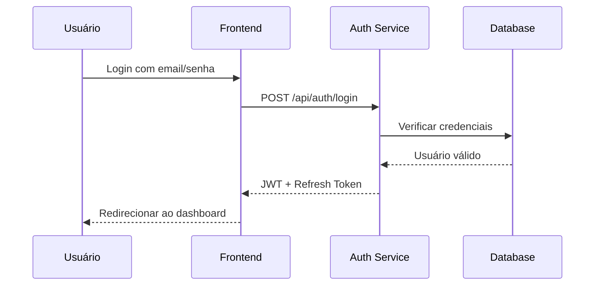
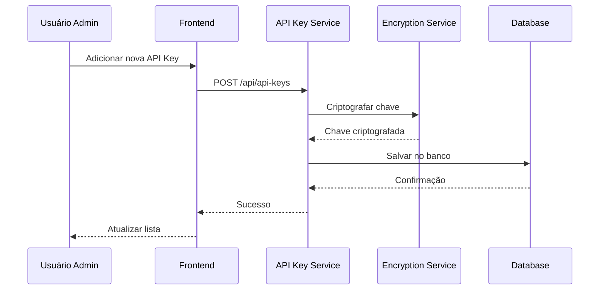
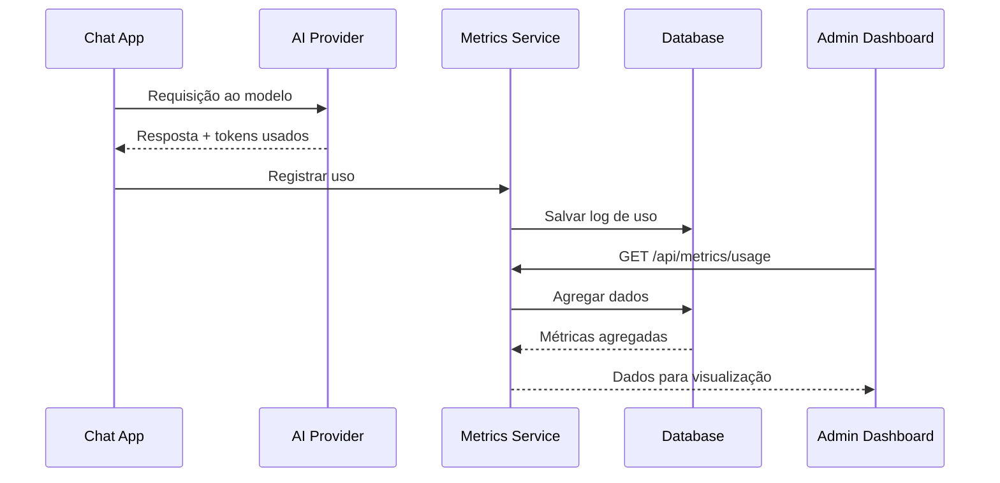

# Arquitetura do Painel Administrativo - MyFabLab.online

## Visão Geral

O painel administrativo do MyFabLab.online é uma interface web moderna e escalável para gerenciar múltiplos provedores de IA, usuários, métricas e configurações do sistema. Construído com Node.js, PostgreSQL e uma interface React responsiva.

## Stack Tecnológico

### Backend
- **Runtime**: Node.js 20+ com Express.js
- **Banco de Dados**: PostgreSQL 15+ com pgvector para embeddings
- **Cache**: Redis para sessões e cache de API
- **Autenticação**: JWT com refresh tokens
- **API**: RESTful com documentação OpenAPI
- **Monitoramento**: Prometheus + Grafana
- **Logs**: Winston com ElasticSearch

### Frontend
- **Framework**: React 18 com TypeScript
- **Estado**: Zustand para gerenciamento de estado
- **UI**: Tailwind CSS + Radix UI
- **Gráficos**: Recharts para visualizações
- **Forms**: React Hook Form + Zod
- **Requests**: Axios com interceptors

## Arquitetura de Microserviços

```
┌─────────────────────────────────────────────────────────────┐
│                     Load Balancer (Nginx)                    │
└─────────────────┬───────────────────────┬──────────────────┘
                  │                       │
        ┌─────────▼────────┐    ┌────────▼────────┐
        │   Admin API      │    │   Chat API      │
        │  (Port 3001)     │    │  (Port 3000)    │
        └─────────┬────────┘    └────────┬────────┘
                  │                       │
        ┌─────────▼───────────────────────▼────────┐
        │           Shared Services                │
        │  - Auth Service                          │
        │  - AI Provider Service                   │
        │  - Metrics Service                       │
        │  - Billing Service                       │
        └─────────┬────────────────────────────────┘
                  │
        ┌─────────▼────────┐    ┌─────────────────┐
        │   PostgreSQL     │    │     Redis       │
        │   (Primary DB)   │    │    (Cache)      │
        └──────────────────┘    └─────────────────┘
```

## Estrutura de Banco de Dados

### Tabelas Principais

```sql
-- Organizações (Multi-tenant)
CREATE TABLE organizations (
    id UUID PRIMARY KEY DEFAULT gen_random_uuid(),
    name VARCHAR(255) NOT NULL,
    slug VARCHAR(255) UNIQUE NOT NULL,
    plan VARCHAR(50) DEFAULT 'free',
    credits INTEGER DEFAULT 0,
    created_at TIMESTAMP DEFAULT NOW(),
    updated_at TIMESTAMP DEFAULT NOW()
);

-- Usuários
CREATE TABLE users (
    id UUID PRIMARY KEY DEFAULT gen_random_uuid(),
    organization_id UUID REFERENCES organizations(id),
    email VARCHAR(255) UNIQUE NOT NULL,
    password_hash VARCHAR(255) NOT NULL,
    role VARCHAR(50) DEFAULT 'member',
    is_active BOOLEAN DEFAULT true,
    last_login TIMESTAMP,
    created_at TIMESTAMP DEFAULT NOW()
);

-- Chaves de API dos Provedores
CREATE TABLE api_keys (
    id UUID PRIMARY KEY DEFAULT gen_random_uuid(),
    organization_id UUID REFERENCES organizations(id),
    provider VARCHAR(50) NOT NULL,
    key_name VARCHAR(255) NOT NULL,
    encrypted_key TEXT NOT NULL,
    is_active BOOLEAN DEFAULT true,
    last_used TIMESTAMP,
    created_at TIMESTAMP DEFAULT NOW()
);

-- Modelos de IA Configurados
CREATE TABLE ai_models (
    id UUID PRIMARY KEY DEFAULT gen_random_uuid(),
    organization_id UUID REFERENCES organizations(id),
    provider VARCHAR(50) NOT NULL,
    model_id VARCHAR(255) NOT NULL,
    display_name VARCHAR(255) NOT NULL,
    config JSONB DEFAULT '{}',
    is_enabled BOOLEAN DEFAULT true,
    created_at TIMESTAMP DEFAULT NOW()
);

-- Logs de Uso
CREATE TABLE usage_logs (
    id UUID PRIMARY KEY DEFAULT gen_random_uuid(),
    organization_id UUID REFERENCES organizations(id),
    user_id UUID REFERENCES users(id),
    model_id VARCHAR(255) NOT NULL,
    tokens_used INTEGER NOT NULL,
    cost_cents INTEGER NOT NULL,
    request_data JSONB,
    response_data JSONB,
    created_at TIMESTAMP DEFAULT NOW()
);

-- Configurações do Sistema
CREATE TABLE system_settings (
    id UUID PRIMARY KEY DEFAULT gen_random_uuid(),
    organization_id UUID REFERENCES organizations(id),
    key VARCHAR(255) NOT NULL,
    value JSONB NOT NULL,
    updated_by UUID REFERENCES users(id),
    updated_at TIMESTAMP DEFAULT NOW(),
    UNIQUE(organization_id, key)
);
```

## Estrutura de Componentes Frontend

```
src/
├── components/
│   ├── layout/
│   │   ├── AdminLayout.tsx
│   │   ├── Sidebar.tsx
│   │   └── Header.tsx
│   ├── dashboard/
│   │   ├── MetricsOverview.tsx
│   │   ├── UsageChart.tsx
│   │   └── RecentActivity.tsx
│   ├── api-keys/
│   │   ├── ApiKeysList.tsx
│   │   ├── AddApiKeyModal.tsx
│   │   └── ApiKeyCard.tsx
│   ├── users/
│   │   ├── UsersList.tsx
│   │   ├── UserForm.tsx
│   │   └── UserPermissions.tsx
│   ├── models/
│   │   ├── ModelsList.tsx
│   │   ├── ModelConfig.tsx
│   │   └── ModelToggle.tsx
│   ├── billing/
│   │   ├── BillingOverview.tsx
│   │   ├── CreditsPurchase.tsx
│   │   └── UsageHistory.tsx
│   └── common/
│       ├── DataTable.tsx
│       ├── LoadingSpinner.tsx
│       └── ErrorBoundary.tsx
├── pages/
│   ├── Dashboard.tsx
│   ├── ApiKeys.tsx
│   ├── Users.tsx
│   ├── Models.tsx
│   ├── Billing.tsx
│   ├── Logs.tsx
│   └── Settings.tsx
├── hooks/
│   ├── useAuth.ts
│   ├── useMetrics.ts
│   └── useApiKeys.ts
├── services/
│   ├── api.ts
│   ├── auth.ts
│   └── metrics.ts
└── store/
    ├── authStore.ts
    ├── metricsStore.ts
    └── settingsStore.ts
```

## APIs REST

### Autenticação
```
POST   /api/auth/login
POST   /api/auth/logout
POST   /api/auth/refresh
GET    /api/auth/me
```

### Chaves de API
```
GET    /api/api-keys
POST   /api/api-keys
PUT    /api/api-keys/:id
DELETE /api/api-keys/:id
POST   /api/api-keys/:id/test
```

### Usuários
```
GET    /api/users
POST   /api/users
PUT    /api/users/:id
DELETE /api/users/:id
PUT    /api/users/:id/permissions
```

### Modelos de IA
```
GET    /api/models
GET    /api/models/available
PUT    /api/models/:id/config
PUT    /api/models/:id/toggle
```

### Métricas
```
GET    /api/metrics/overview
GET    /api/metrics/usage
GET    /api/metrics/costs
GET    /api/metrics/performance
```

### Billing
```
GET    /api/billing/current
GET    /api/billing/history
POST   /api/billing/credits
GET    /api/billing/invoices
```

### Logs
```
GET    /api/logs/usage
GET    /api/logs/errors
GET    /api/logs/audit
```

### Configurações
```
GET    /api/settings
PUT    /api/settings/:key
GET    /api/settings/export
POST   /api/settings/import
```

## Fluxo de Dados

### 1. Autenticação


### 2. Gerenciamento de API Keys


### 3. Monitoramento de Uso


## Segurança

### 1. Autenticação e Autorização
- JWT com expiração curta (15 min) + Refresh tokens
- RBAC com roles: owner, admin, member, viewer
- MFA opcional com TOTP

### 2. Proteção de API Keys
- Criptografia AES-256 no banco
- Mascaramento parcial na UI
- Rotação automática disponível
- Logs de acesso detalhados

### 3. Rate Limiting
- Por IP: 100 req/min
- Por usuário: 1000 req/hora
- Por organização: 10000 req/hora

### 4. Auditoria
- Todos os eventos importantes logados
- Retenção de logs por 90 dias
- Exportação para compliance

## Performance

### 1. Cache Strategy
- Redis para sessões de usuário
- Cache de métricas agregadas (TTL: 5 min)
- Cache de configurações (TTL: 1 hora)

### 2. Database Optimization
- Índices em campos de busca frequente
- Particionamento de tabelas de logs por mês
- Vacuum automático diário

### 3. Frontend Optimization
- Code splitting por rota
- Lazy loading de componentes pesados
- Service Worker para cache offline
- Compressão gzip/brotli

## Monitoramento

### 1. Métricas de Aplicação
- Latência de API (p50, p95, p99)
- Taxa de erro por endpoint
- Uso de CPU/memória
- Conexões de banco ativas

### 2. Métricas de Negócio
- Usuários ativos diários/mensais
- Tokens consumidos por modelo
- Custo por organização
- Taxa de conversão de planos

### 3. Alertas
- API fora do ar
- Taxa de erro > 5%
- Uso de créditos > 80%
- Tentativas de login suspeitas

## Deployment

### 1. Ambientes
- Development: Local com Docker Compose
- Staging: Kubernetes no GKE
- Production: Kubernetes multi-região

### 2. CI/CD Pipeline
- GitHub Actions para testes
- Build de imagens Docker
- Deploy automático para staging
- Deploy manual para produção

### 3. Rollback Strategy
- Blue-green deployment
- Rollback automático em falhas
- Backup de banco antes de migrações